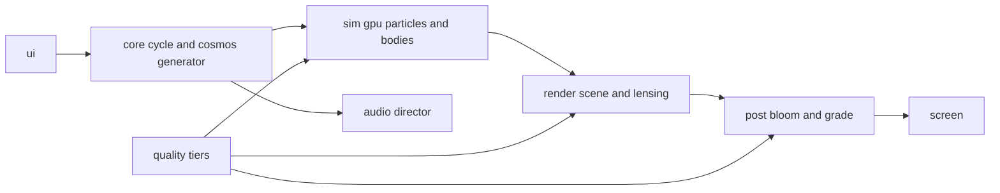

# Everything Must Go design spec

A single-page WebGL art site. A spinning black hole consumes an entire procedurally generated cosmos over a twelve-minute cycle, then a new cosmos is born and it starts again. No product, no content strategy, no nav. The site is the piece.

Date: 2026-07-02. Status: approved by MD through five visual sketch iterations (see decisions log).

## The piece in one paragraph

You arrive at an enter gate, choose sound on or off, and land in a vast cosmic scene rendered in cinematic realism: a lensed black hole with a folded accretion disk at center, surrounded by a dying solar system of seven to ten planets, moons, an asteroid belt, comets, a pulsar, nebulae in wild Hubble-palette colors, two satellite galaxies, and thousands of stars including a galactic band. The black hole starts small and grows as it eats. Inner worlds die first. Moons are stripped before their planets crack. An ominous orchestral score builds with the destruction. Occasionally an impossible silhouette drifts through, a whale or a grand piano backlit by the disk's fire, stretches into a streak, and dies. Around halfway, one cosmos in four spawns a rogue second black hole that feeds itself and then merges with the main one. At the end the screen falls almost black, holds, and a white shockwave reseeds a new cosmos with a new palette and layout. Every cosmos is unique and reproducible by seed.

## The cycle

Master arc driven by a cycle state machine. Default length 720 seconds, a build constant.

| Phase | Progress | What happens |
|---|---|---|
| Serene | 0–25% | Majestic slow orbits, near-silence, small hole, full cosmos visible |
| Decay | 25–60% | Orbits visibly decay, belt drains, inner planets die, music enters |
| Carnage | 60–92% | Hole large, galaxies shredded, stars plunge, music at full tension |
| Darkness | 92–97% | Almost nothing left, near-black screen, music cuts to silence |
| Rebirth | 97–100% | White shockwave, new seed, new cosmos, soft musical resolution |

The hole's radius and pull grow with progress. The camera pulls back roughly 45% over the cycle so the scene keeps revealing how big it was. Physics constants are scheduled, not simulated cosmology: drag and gravity scale with progress so the death order reads clearly (belt and inner planets, then nebulae and outer planets, then galaxies, then field stars).

## Structure roster

Each cosmos draws a roster from this menu. Counts are procedural ranges, seeded.

| Structure | Count | Death behavior |
|---|---|---|
| Accretion disk | always | Persists, fed by everything; drains only in darkness phase |
| Planets | 7–10 | Rings stripped first, then tidal stretch, then crack into debris |
| Ringed planets | 2–3 of the planets | Ring particles released as a visible shower |
| Moons | 0–4 total | Tidally stripped from their planet before it breaks, plunge alone |
| Asteroid belt | 1 | Drains grain by grain through decay phase |
| Nebulae | 3–5 | Layered clouds; drained as glowing wisp streams into the disk |
| Satellite galaxies | 2 dynamic + decor | Dragged in whole, smeared into colored streams |
| Star clusters | 0–2 | Dense swarm, swallowed as a unit |
| Comets | 4–6 | Eccentric orbits, shed tails, die at the horizon |
| Pulsar | 0–1 | Strobing point with sweeping beams, plunges mid-cycle |
| Field stars | thousands | Static sky until late; plunge and streak in carnage phase |
| Galactic band | 1 | Baked sky layer; dims and drifts inward as consumption proceeds |
| Rogue black hole | 25% of cosmoses | Spawns ~50%, eats its own stream, merges: flash, chirp, hole grows |
| Shooting stars | ambient | Pure decor, every 10–18 s |

## The cast

The absurdist counterweight: recognizable Earth objects also fall in. Whale, grand piano, T. rex, teacup, bicycle, rubber duck. Roster is extendable at build time.

Rendering: backlit silhouettes. Near-black shapes with a warm rim light from the disk side. They enter on decaying orbits, tidally stretch along the fall direction, shed glowing debris, and dissolve. No textures, no 3D models at runtime; shapes are baked to alpha masks or SDFs by a build script.

Spawning: auto every 45–75 s during decay and carnage, max two alive. A click or tap sends the next cast member in from the click direction. Cast is disabled during serene and darkness so the tone holds.

## Interaction

- Cursor or touch-drag is a weak gravity well. Nearby gas and debris bend toward it. Radius about 12% of the viewport's short side, force clamped so it stirs but cannot rescue anything.
- Click or tap feeds the next silhouette from that direction.
- No camera controls. Fixed composition, slow drift, subtle mouse parallax.
- Left alone the piece performs itself completely.
- The title gets eaten too: every 90–150 s one letter of EVERYTHING MUST GO detaches, falls, stretches, and dies; the title regrows it over ~10 s.
- About link (one small corner element) opens a one-paragraph overlay: what this is, source repo, imagery and font credits.

## Sound

Ominous and grand, not classical-recital. An adaptive dark orchestral score, layered and driven by cycle progress rather than a fixed recording, so the arc always syncs:

- Base drone (low, detuned) present from serene phase at low level.
- Low pad and slow swells enter through decay.
- A dissonant tension layer grows through carnage.
- Sparse percussion hits accent planet breaks and galaxy deaths.
- A rising gravitational-wave chirp marks the rogue-hole merger.
- Darkness phase is true silence. Rebirth gets a short, soft resolution.

Sources: synthesized layers (WebAudio) plus CC0 orchestral or dark-ambient samples where they raise quality; licenses verified before inclusion and credited in the about overlay. Event one-shots are synthesized. Browsers block autoplay, so the enter gate offers "enter with sound" and "enter silent"; a corner toggle switches later. Sound state persists in localStorage.

## Art direction

Cinematic realism. The reference composition is the lensed black hole: a circular shadow wrapped in a thin white photon ring, the disk crossing in front at the bottom and folding in an arc above, background stars smearing near the ring.

- Disk colors are physical blackbody: white core through gold and orange to deep red rim. One side brighter (Doppler beaming).
- Wild color lives in the nebulae and sky, regenerated per cosmos from a seeded palette (analogous, triadic, or clash schemes in 5–7 hues). Background is near-black tinted by the cosmos hue.
- Planets are shaded spheres with procedural surfaces (banded giants, speckled rocky, pale ice) and mesh rings, lit by the disk, so terminators face outward.
- Nebulae are layered billboard clouds with dark dust lanes. NASA/ESA public-domain or CC-BY imagery may seed textures; attribution in the about overlay.
- Post: HDR bloom, filmic tonemap, vignette, fine grain. Subtle chromatic aberration near the hole only.
- Typography: EVERYTHING MUST GO in letterspaced caps, small, top-left; one caption line under it; consumed counter bottom-left ("cosmos no. 4 · 62% consumed"). Nothing else on screen.

## Architecture

Stack: Vite, TypeScript, three.js. No UI framework. Static output, hosted on GitHub Pages via Actions (SHA-pinned actions, lockfile committed, osv-scanner on the lockfile in CI). Repo: `~/projects/everything-must-go`, public, source-linked from the site.

- `core/`: requestAnimationFrame loop, cycle state machine, cosmos generator. The generator is a pure function: seed in, cosmos description out (palette, roster, layout, schedules). Deterministic, unit-testable, and shareable via `?seed=`.
- `sim/`: GPU particle simulation. Positions and velocities live in ping-pong float textures; forces are central gravity, scheduled drag, cursor well, and structure anchors. The ~30 discrete bodies (planets, moons, comets, rogue hole, cast) integrate on the CPU each frame.
- `render/`: disk gas material, lensing post-pass (screen-space light-bending approximation: radial distortion field plus analytically drawn fold and photon ring; full geodesic raytracing is explicitly out of scope), textured planet spheres and rings, nebula billboards, instanced starfield and band, silhouette cast with rim-light shader.
- `post/`: bloom, tonemap, vignette, grain.
- `audio/`: music director mapping cycle progress to layer gains, event one-shots, analyser feeding small visual accents. Owns the enter-gate audio unlock.
- `quality/`: tier detection and live adjustment (below).
- `ui/`: enter gate, title with letter-eating, counter, about overlay, sound toggle.
- `tools/`: build-time script that bakes cast shapes to masks/SDFs and pre-generates any texture atlases.

Data flow is one-directional: core state drives sim, sim drives render, render drives post. Audio reads the same core state. No shared mutable state across modules beyond the core cycle object.

## Quality tiers and failure handling

- Requires WebGL2. Missing or failed context: show a pre-rendered poster frame with one line of text and the about link. Never a blank page.
- Tier probe: GPU heuristic plus a 3-second fps measurement at startup behind the enter gate.
  - High: 600k–1M particles, full lensing, full bloom. Desktop discrete GPUs.
  - Medium: 150k–300k particles, half-res lensing, reduced bloom. Integrated GPUs, recent phones.
  - Low: 40k–80k particles, no lens distortion (composition keeps the painted fold), static nebula layer. Old phones.
- Live downgrade: sustained fps below 24 for 5 s drops one tier. Logged to console, no UI interruption.
- Context loss: listener rebuilds the pipeline and resumes the cycle at the same progress.
- Hidden tab: loop and audio suspend; resume without a time jump.
- prefers-reduced-motion: paused poster with an explicit play button; no auto-starting motion.
- `?debug` HUD shows fps, tier, particle count, cycle progress. `?seed=<n>` pins the cosmos.

## Testing and verification

- Unit (vitest): cosmos generator determinism (same seed, same cosmos; different seeds differ), cycle state machine transitions and phase boundaries, palette generator output ranges, orbit and schedule math, tier chooser logic.
- Smoke (Playwright): page loads, WebGL2 context acquired, zero console errors, enter gate works with and without sound, toggles and about overlay function, `?seed` and `?debug` respected.
- Performance: verified on MD's Mac (high tier), a CPU/GPU-throttled Chrome profile (medium), and at least one real phone (low). Numbers recorded in the repo before deploy claims are made.
- Aesthetics: verified by MD on the live dev server at each milestone. This is the acceptance authority for look and feel; no milestone closes without it.

## Milestones

Each milestone ends with something watchable on the dev server and an explicit MD sign-off.

1. Money shot. Scaffold, GPU disk sim, hole with painted fold and photon ring, lensing pass, bloom. One static cosmos, no cycle. Accept: it already looks like the piece.
2. The cycle. Cosmos generator, state machine, consumption schedules, camera pull, darkness and rebirth. Accept: a full 12-minute death and rebirth runs unattended.
3. The cosmos. Planets, moons, rings, belt, comets, pulsar, galaxies, nebulae, band, shooting stars. Accept: the approved structure roster at real fidelity.
4. Hands and guests. Cursor well, click-to-feed, silhouette cast, title letter-eating, rogue-hole merger. Accept: interactions feel weighty, cast dies beautifully.
5. Sound. Music director, layers, event hits, chirp, enter gate, persistence. Accept: build-up lands with sound on; silent mode stands alone.
6. Everyone else. Quality tiers, mobile touch, fallbacks, reduced motion, meta tags and OG image, deploy to GitHub Pages. Accept: phone test passes, deployed URL loads clean.

## Out of scope for v1

- WebGPU compute path (architecture isolates `sim/` so it can be swapped later).
- True geodesic lensing.
- Runtime 3D model loading for the cast.
- A fixed classical recording driving the arc (superseded by the adaptive score decision).
- Social features, galleries of past cosmoses, seed-sharing UI beyond the URL param.
- Custom domain (github.io URL first; the `everything-must-go.art` name used in sketches is a placeholder, not registered).

## Decisions log

| Decision | Choice | Notes |
|---|---|---|
| Purpose | Art piece, the site is the point | Not a portfolio or landing page |
| Concept | Spinning black hole swallowing a cosmos | From MD's opening fragment |
| Cast tone | "Everything must go": absurd objects fall in too | Whale, piano, T. rex... |
| Medium | Particles plus discrete bodies | "Particle collisions" fragment |
| Art style | Light trails chosen, then superseded by cinematic realism | MD: "dial down particles, focus on realism" |
| Scale | Grew from one disk to full solar system in a dying galaxy | Three "grander" iterations |
| Lifecycle | Cosmos eaten to darkness, then reborn, ~12 min | Hole grows as it eats |
| Cast rendering | Backlit silhouettes with rim light | Keeps absurdism inside realism |
| Music | Ominous and grand adaptive score, not classical recording | MD amendment at architecture review |
| Tech | three.js + WebGL2 GPGPU (approach A) | WebGPU deferred; runs everywhere |
| Devices | Desktop-first, phone-graceful | Tiered quality |
| Rogue hole | Kept, 25% of cosmoses, merger with chirp | Reward for patient viewers |
